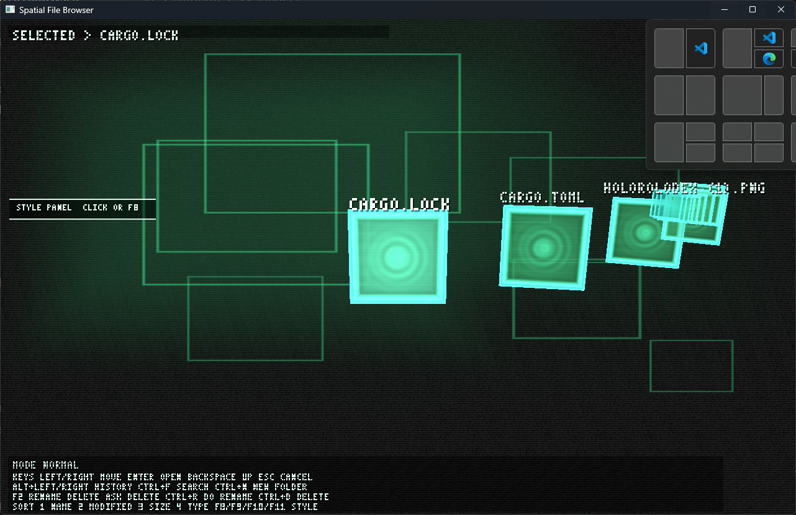

# Rust File Browser Reimagined

A futuristic Rust desktop file browser with a holographic, spatial UI.  
This project explores a different take on file management by combining practical file navigation with a bold 3D-inspired interface.

## What it does

- Browse files and folders
- Navigate directories
- Open items
- Display files, folders, and apps with distinct visual styling
- Experiment with a holographic retro-futuristic interface in Rust

## Why it is interesting

Most file browsers look and feel the same. This project pushes in a different direction by treating the file system like an interactive visual space instead of a plain list of rows.

## Screenshot



## Getting started

### 1. Clone the repository

```bash
git clone https://github.com/feenix100/3d_file_browser
cd 3d_file_browser
```

### 2. Build the project

```bash
cargo build
```

### 3. Run the app

```bash
cargo run
```

## Requirements

- Rust
- Cargo

## Project goal

The goal of this app is to show that Rust can be used to build desktop software that is not only fast and reliable, but also visually ambitious.

## License

Add your preferred license here.
